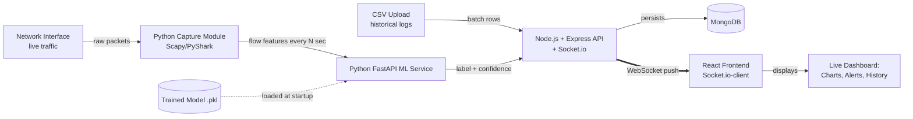
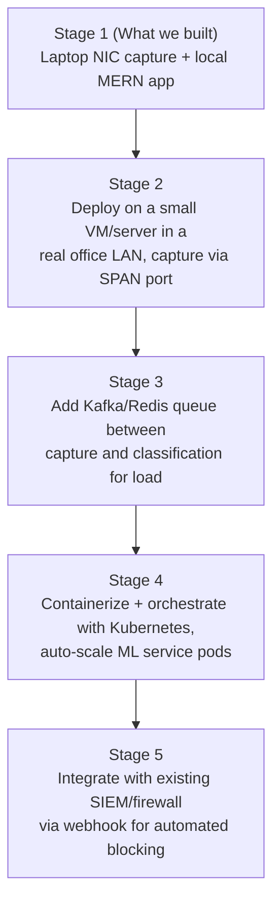

# 🛡️ NetGuard AI — AI-Powered Network Attack Forecasting System

> **Smart India Hackathon 2026 — Problem Statement SIH26153**
> *AI-based Network Attack Forecasting from Network Traffic Data*
>
> A 5th Semester VTU Mini Project

---

## 📌 Table of Contents

1. [Problem Statement](#-problem-statement)
2. [Our Solution](#-our-solution)
3. [Key Features](#-key-features)
4. [Tech Stack](#-tech-stack)
5. [System Architecture](#-system-architecture)
6. [Real-Time Traffic Capture (Genuine Live Demo)](#-real-time-traffic-capture-genuine-live-demo)
7. [Folder Structure](#-folder-structure)
8. [Dataset](#-dataset)
9. [Machine Learning Pipeline](#-machine-learning-pipeline)
10. [Installation & Setup](#-installation--setup)
11. [Environment Variables](#-environment-variables)
12. [API Documentation](#-api-documentation)
13. [How It Works (Demo Flow)](#-how-it-works-demo-flow)
14. [Scalability — From Laptop Demo to Production](#-scalability--from-laptop-demo-to-production)
15. [Real-World Deployment Path](#-real-world-deployment-path)
16. [Limitations & Assumptions](#-limitations--assumptions)
17. [Future Scope](#-future-scope)
18. [FAQ / Anticipated Viva Questions](#-faq--anticipated-viva-questions)
19. [Team](#-team)
20. [License](#-license)

---

## 🎯 Problem Statement

Modern networks generate massive volumes of traffic every second. Traditional signature-based
firewalls and Intrusion Detection Systems (IDS) can only catch **known** attack patterns, leaving
networks vulnerable to novel or evolving threats such as:

- Denial of Service (DoS) / Distributed DoS (DDoS) attacks
- Port scanning and reconnaissance activity
- Brute-force login attempts
- Botnet traffic

**Goal:** Build a system that analyzes network traffic flow data and **forecasts / classifies**
potential attacks in near real-time, using AI/ML instead of static rule-matching — giving network
administrators an early warning dashboard.

> ⚠️ **Note:** This project does **not** involve blockchain, cryptocurrency, or distributed ledger
> technology in any form. It is a pure **network security + machine learning** solution.

---

## 💡 Our Solution

**NetGuard AI** is a full-stack web application where:

1. Traffic reaches the system in one of two ways:
   - **Genuinely live** — a Python packet-sniffing module captures real traffic off a network
     interface (your own laptop/router Wi-Fi) and converts it into flow features on the fly, **or**
   - **Batch/replay** — an administrator uploads a historical traffic log (CSV) for analysis.
2. A lightweight **Python ML microservice** analyzes each traffic flow's features (packet size,
   duration, flag counts, byte rates, etc.) as they arrive.
3. Each flow is classified as **Normal** or a specific **attack type** (DoS, Port Scan, Brute
   Force, etc.) with a confidence score, **the instant it's computed** — pushed to the frontend
   over a WebSocket connection, not polled.
4. Results are displayed on a **live-updating dashboard** with charts, historical logs, and alerts.
5. The architecture is designed so the same pipeline that works on a laptop capturing home Wi-Fi
   traffic can be swapped, component-by-component, for a production-scale deployment ingesting
   traffic from an entire organization's network — this scaling path is spelled out explicitly in
   the [Real-World Deployment Path](#-real-world-deployment-path) section below.

We deliberately chose **classical Machine Learning (Random Forest / XGBoost)** over deep learning
because:

- Network flow data is **tabular**, not sequential/image/audio data — tree-based models
  outperform deep learning here and are proven in IDS research (CICIDS2017 benchmark papers).
- Training is fast (minutes, no GPU needed), which fits a semester timeline.
- Tree-based models are **explainable** (feature importance), which is a strong answer to
  "why did the model flag this?" — a common evaluator question.

---

## ✨ Key Features

- 🔴 **True Real-Time Packet Capture** — sniffs live traffic off a real network interface
  (your machine's Wi-Fi/Ethernet), extracts flow features in sliding time windows, and classifies
  them as they happen — not a simulation
- ⚡ **WebSocket Live Push** — the dashboard updates the instant a flow is classified, no polling
- 📂 **CSV Upload & Batch Analysis** — also supports uploading historical traffic logs for
  retrospective analysis or offline demos where live capture isn't possible (e.g., restricted lab
  networks)
- 📊 **Interactive Dashboard** — attack-type distribution charts, timeline of flagged events
- 🚨 **Alert System** — toast/email notification when a high-confidence attack is detected
- 📜 **Scan History** — every analysis run is stored and searchable
- 🔐 **Role-based Login** — Admin vs. Viewer accounts (JWT-based auth)
- 📈 **Model Explainability Panel** — shows top contributing features for each flagged flow
- 🧾 **Exportable Reports** — download a PDF/CSV summary of a scan session

---

## 🧰 Tech Stack

We intentionally kept this **simple and well-documented** — no blockchain, no GPU-dependent deep
learning, no exotic infrastructure.

| Layer                  | Technology                                              | Why |
|-------------------------|----------------------------------------------------------|-----|
| Frontend                | **React.js** + Recharts/Chart.js + **Socket.io-client**  | Component-based UI, live charts that update via WebSocket push |
| Backend (App server)    | **Node.js** + **Express.js** + **Socket.io**              | Handles auth, file uploads, orchestrates ML calls, pushes live results to the browser |
| Database                | **MongoDB** (Mongoose ODM)                               | Flexible schema for logs/scan history, pairs naturally with Node |
| Real-Time Capture       | **Python** + **Scapy** (or **PyShark**)                   | Sniffs live packets off a network interface, groups them into flows |
| ML Microservice         | **Python** + **FastAPI**                                  | Lightweight REST API wrapping the trained model, called per-flow |
| ML Libraries            | **scikit-learn**, **pandas**, **XGBoost**                 | Tabular classification — no deep learning required |
| Streaming (optional, for scale) | **Redis Streams** or **Kafka**                    | Decouples capture from classification so both can scale independently in production |
| Authentication          | **JWT** (jsonwebtoken) + bcrypt                           | Standard, simple, well-documented |
| Dataset                 | **CICIDS2017** / **NSL-KDD** (public, pre-labeled)        | Industry-standard benchmark datasets for IDS research — used to *train* the model, which then scores live traffic |
| Containerization        | **Docker** + **docker-compose**                            | One command spins up frontend, backend, ML service, and DB together — also the first step toward Kubernetes |
| Deployment (optional)   | Render / Railway (Node+Mongo) + a small always-on VM/EC2 for the packet-capture + FastAPI pair | Packet capture needs a real NIC, so it runs on a VM/on-prem box rather than typical serverless hosting |

> ✅ **No blockchain. No smart contracts. No distributed ledgers.** Every piece here is a standard,
> widely-documented tool — nothing exotic, nothing you'd need specialized infra to run.

---

## 🏗️ System Architecture



**Flow explanation:**

1. **Capture module** (Python + Scapy) sniffs packets off a chosen network interface in the
   background, groups them into flows using a sliding time window (e.g., every 2–5 seconds), and
   computes the same statistical features the model was trained on (packet count, duration, byte
   rate, flag counts, etc.). Alternatively, historical data can be uploaded as CSV for batch mode.
2. The capture module (or the CSV upload handler) sends each flow's features to the **FastAPI**
   ML service over HTTP.
3. **FastAPI** loads the pre-trained `.pkl` model (scikit-learn/XGBoost) once at startup, runs
   `.predict()` and `.predict_proba()`, and returns `{ label, confidence, top_features }`.
4. **Express** receives the result, stores it in **MongoDB**, and immediately **pushes it to every
   connected browser via Socket.io** — no polling, no refresh needed.
5. **React** receives the WebSocket event and updates the dashboard live — new points animate
   onto the chart, red alerts pop up the instant a threat is classified.

This is called a **polyglot microservice architecture** — each language/tool handles what it's
best at, and capture is decoupled from classification so either piece can be scaled or swapped
independently.

---

## 🔴 Real-Time Traffic Capture (Genuine Live Demo)

This is the piece that turns the project from "a dataset demo" into "a genuinely real-time
system" — and it's simpler to build than it sounds.

### How it works

1. **Capture packets** using Scapy (Python), which can sniff on your machine's active network
   interface (Wi-Fi or Ethernet) with admin/root privileges:

   ```python
   from scapy.all import sniff

   def process_packet(packet):
       # extract src/dst IP, port, protocol, packet size, timestamp
       queue.append(packet)

   sniff(iface="Wi-Fi", prn=process_packet, store=False)
   ```

2. **Group packets into flows** using a sliding time window (a "flow" = all packets between the
   same src/dst IP+port pair within a time span). Every few seconds, compute the same statistical
   features CICIDS2017 uses: flow duration, total packets, byte rate, SYN/ACK/FIN flag counts,
   average packet size, etc.

3. **Send the computed feature vector** to the FastAPI `/predict` endpoint — exactly the same
   endpoint used for CSV batch mode, so there's only one prediction code path to maintain.

4. **Push the result live** to the dashboard via Socket.io the moment it's classified.

### Why this is a strong, honest real-time claim

- It's not a simulation — it is actually reading real packets flowing through the machine it runs
  on. Running a port scanner (e.g., `nmap`) against your own machine in a demo will visibly light
  up the dashboard in real time, which is a genuinely convincing live demonstration.
- It requires **no special hardware** — any laptop's own network interface works for a
  local-network demo. For a classroom/lab demo, capturing traffic on the same Wi-Fi network as a
  test attack machine works well.
- It naturally leads into the production scaling story (see below) — the exact same feature
  extraction logic, unmodified, is what a real enterprise deployment would run on mirrored switch
  traffic instead of a laptop's own interface.

### Practical notes

- **Windows** needs [Npcap](https://npcap.com/) installed for Scapy to capture packets.
- **Linux/Mac** needs the app to run with elevated privileges (`sudo python capture.py`).
- For safety and to keep the scope legal/ethical, only capture traffic on **networks and devices
  you own or have explicit permission to monitor** — this is worth stating directly in your
  report, and evaluators appreciate seeing that awareness.

---

## 📁 Folder Structure

```
netguard-ai/
├── client/                        # React frontend
│   ├── src/
│   │   ├── components/
│   │   │   ├── Dashboard.jsx
│   │   │   ├── UploadPanel.jsx
│   │   │   ├── AlertToast.jsx
│   │   │   ├── HistoryTable.jsx
│   │   │   └── FeatureImportanceChart.jsx
│   │   ├── pages/
│   │   │   ├── Login.jsx
│   │   │   └── Home.jsx
│   │   ├── services/
│   │   │   └── api.js              # Axios calls to Express backend
│   │   └── App.jsx
│   └── package.json
│
├── server/                        # Node.js + Express backend
│   ├── models/
│   │   ├── User.js
│   │   └── ScanResult.js
│   ├── routes/
│   │   ├── auth.routes.js
│   │   ├── scan.routes.js
│   │   └── history.routes.js
│   ├── controllers/
│   │   ├── auth.controller.js
│   │   └── scan.controller.js
│   ├── middleware/
│   │   └── authMiddleware.js
│   ├── utils/
│   │   └── mlServiceClient.js      # calls the Python FastAPI service
│   ├── server.js
│   └── package.json
│
├── ml-service/                    # Python FastAPI microservice
│   ├── model/
│   │   ├── train_model.py          # one-time training script
│   │   └── attack_classifier.pkl   # saved trained model
│   ├── main.py                     # FastAPI app with /predict endpoint
│   ├── preprocess.py                # feature scaling/encoding logic
│   └── requirements.txt
│
├── capture-service/               # Python real-time packet capture module
│   ├── sniffer.py                   # Scapy-based packet capture
│   ├── flow_builder.py              # groups packets into flows (sliding window)
│   ├── feature_extractor.py         # computes CICIDS2017-style statistical features
│   ├── stream_client.py             # sends flow features to FastAPI /predict + relays to Express
│   └── requirements.txt
│
├── dataset/
│   └── CICIDS2017_sample.csv       # trimmed sample for local dev/testing
│
├── docs/
│   ├── architecture-diagram.png
│   └── report.pdf
│
├── .env.example
├── docker-compose.yml              # optional: run all 3 services together
└── README.md
```

---

## 📊 Dataset

We use the **CICIDS2017** dataset (Canadian Institute for Cybersecurity), a widely-cited,
publicly available benchmark dataset for intrusion detection research. It contains labeled
network flow records covering:

- Benign traffic
- DoS/DDoS attacks (Hulk, GoldenEye, Slowloris, etc.)
- Port Scan
- Brute Force (FTP-Patator, SSH-Patator)
- Web Attacks (SQL Injection, XSS)
- Botnet traffic

**Alternative:** NSL-KDD (a cleaned-up version of the older KDD Cup 1999 dataset) is smaller and
easier to work with if CICIDS2017 feels too large for a first pass.

Each row represents one **network flow** (not a raw packet) with ~78 statistical features such as:

| Feature | Description |
|---|---|
| `Flow Duration` | Duration of the flow in microseconds |
| `Total Fwd Packets` | Number of packets sent forward |
| `Total Backward Packets` | Number of packets sent backward |
| `Flow Bytes/s` | Flow byte rate |
| `Flow Packets/s` | Flow packet rate |
| `SYN Flag Count` | Count of SYN flags — useful for detecting SYN floods |
| `Average Packet Size` | Mean size across the flow |
| ... | (~70 more statistical features) |

> 📥 Download: search "CICIDS2017 dataset" on the University of New Brunswick's CIC website, or
> find pre-processed CSV versions on Kaggle for easier local development.

---

## 🧠 Machine Learning Pipeline

```
Raw CSV (CICIDS2017)
      │
      ▼
1. Data Cleaning        → remove nulls, infinite values, duplicate rows
      │
      ▼
2. Feature Selection    → drop highly correlated / constant columns
      │
      ▼
3. Encoding & Scaling   → label-encode attack categories, StandardScaler on numeric features
      │
      ▼
4. Train/Test Split     → 80/20 stratified split
      │
      ▼
5. Model Training       → Random Forest / XGBoost Classifier
      │
      ▼
6. Evaluation           → Accuracy, Precision, Recall, F1-score, Confusion Matrix
      │
      ▼
7. Export Model         → joblib/pickle → attack_classifier.pkl
      │
      ▼
8. Serve via FastAPI    → /predict endpoint loads .pkl and returns live predictions
```

**Sample training snippet (`ml-service/model/train_model.py`):**

```python
import pandas as pd
from sklearn.model_selection import train_test_split
from sklearn.ensemble import RandomForestClassifier
from sklearn.metrics import classification_report, confusion_matrix
import joblib

df = pd.read_csv("../../dataset/CICIDS2017_sample.csv")
df = df.dropna()

X = df.drop(columns=["Label"])
y = df["Label"]

X_train, X_test, y_train, y_test = train_test_split(
    X, y, test_size=0.2, stratify=y, random_state=42
)

model = RandomForestClassifier(n_estimators=200, max_depth=15, random_state=42)
model.fit(X_train, y_train)

y_pred = model.predict(X_test)
print(classification_report(y_test, y_pred))
print(confusion_matrix(y_test, y_pred))

joblib.dump(model, "attack_classifier.pkl")
```

**Serving snippet (`ml-service/main.py`):**

```python
from fastapi import FastAPI
from pydantic import BaseModel
import joblib
import numpy as np

app = FastAPI()
model = joblib.load("model/attack_classifier.pkl")

class TrafficFlow(BaseModel):
    features: list[float]

@app.post("/predict")
def predict(flow: TrafficFlow):
    X = np.array(flow.features).reshape(1, -1)
    prediction = model.predict(X)[0]
    confidence = max(model.predict_proba(X)[0])
    return {"label": prediction, "confidence": round(float(confidence), 4)}
```

---

## ⚙️ Installation & Setup

### Prerequisites
- Node.js v18+
- Python 3.10+
- MongoDB (local install or free MongoDB Atlas cluster)
- npm / yarn

### 1. Clone the repository
```bash
git clone https://github.com/<your-username>/netguard-ai.git
cd netguard-ai
```

### 2. Set up the ML microservice
```bash
cd ml-service
pip install -r requirements.txt

# Train the model (only needs to be run once)
python model/train_model.py

# Start the FastAPI service
uvicorn main:app --reload --port 8000
```

### 3. Set up the backend (Express)
```bash
cd ../server
npm install
cp .env.example .env   # fill in your MongoDB URI and JWT secret
npm run dev            # starts on http://localhost:5000
```

### 4. Set up the frontend (React)
```bash
cd ../client
npm install
npm start               # starts on http://localhost:3000
```

### 5. Set up the real-time capture module
```bash
cd ../capture-service
pip install -r requirements.txt

# Windows only: install Npcap first from https://npcap.com/

# Linux/Mac: run with elevated privileges to allow packet sniffing
sudo python sniffer.py --iface eth0

# Windows (run terminal as Administrator):
python sniffer.py --iface "Wi-Fi"
```
> ⚠️ Only run this against a network/interface you own or have explicit permission to monitor.

### 6. (Optional) Run everything with Docker Compose
```bash
docker-compose up --build
```
> Note: the `capture-service` container needs `network_mode: host` (Linux) or a bridged adapter
> to actually see real traffic — this is called out in `docker-compose.yml` with a comment.

---

## 🔑 Environment Variables

**`server/.env`**
```env
PORT=5000
MONGO_URI=mongodb://localhost:27017/netguard
JWT_SECRET=your_jwt_secret_here
ML_SERVICE_URL=http://localhost:8000
```

**`ml-service/.env`** *(optional, if you externalize config)*
```env
MODEL_PATH=model/attack_classifier.pkl
```

---

## 📡 API Documentation

### Express Backend

| Method | Endpoint | Description | Auth Required |
|--------|-----------|--------------|----------------|
| POST | `/api/auth/register` | Register a new user | ❌ |
| POST | `/api/auth/login` | Login, returns JWT | ❌ |
| POST | `/api/scan/upload` | Upload CSV for batch analysis | ✅ |
| POST | `/api/scan/single` | Analyze a single traffic record | ✅ |
| GET  | `/api/scan/history` | Get past scan results | ✅ |
| GET  | `/api/scan/:id` | Get details of one scan | ✅ |
| DELETE | `/api/scan/:id` | Delete a scan record | ✅ (Admin) |

### Python ML Service

| Method | Endpoint | Description |
|--------|-----------|--------------|
| POST | `/predict` | Accepts feature array, returns `{label, confidence}` |
| GET  | `/health` | Health check for the ML service |
| GET  | `/model-info` | Returns model metadata (version, training date, accuracy) |

**Example request to `/predict`:**
```json
POST /predict
{
  "features": [0.5, 120, 3, 0.02, 1, 0, 512, ...]
}
```

**Example response:**
```json
{
  "label": "DDoS",
  "confidence": 0.9734
}
```

### WebSocket Events (Socket.io — Express ↔ React)

| Event Name | Direction | Payload | Description |
|------------|-----------|---------|--------------|
| `flow:classified` | Server → Client | `{ id, srcIp, dstIp, label, confidence, timestamp }` | Emitted the instant a new flow (live or batch) is classified |
| `alert:triggered` | Server → Client | `{ id, label, confidence, srcIp }` | Emitted only for high-confidence attack detections (e.g., confidence > 0.85) |
| `capture:status` | Server → Client | `{ status: "running" \| "stopped", iface }` | Lets the dashboard show whether live capture is currently active |
| `capture:start` / `capture:stop` | Client → Server | `{ iface }` | Admin can start/stop the live capture module from the UI |

---

## 🎬 How It Works (Demo Flow)

1. **Login** as Admin.
2. Click **"Start Live Capture"** and select your active network interface. The capture module
   begins sniffing real traffic in the background.
3. In a second window/terminal, run a **benign action** (browse a website) and then a **test
   attack** against your own machine — e.g., `nmap -sS <your-IP>` for a port scan, or a simple
   brute-force script hitting a local test SSH/FTP service.
4. Watch the **dashboard update live** the moment each flow is classified — normal traffic stays
   green, and the port-scan/brute-force traffic turns red with the attack type labeled, pushed
   over WebSocket with no page refresh.
5. Click on any flagged event to see the **feature importance breakdown** (why the model flagged
   it — e.g., "abnormally high SYN flag count + short flow duration → DoS pattern").
6. Alternatively, use the **Upload Panel** to run the same pipeline against the CICIDS2017 CSV for
   a controlled, repeatable batch demo (useful as a fallback if live capture isn't permitted on
   the demo network, e.g., a locked-down college Wi-Fi).
7. Check the **History tab** to see all past scans, filterable by date/attack type.
8. Export a **PDF summary report** of the session.

---

## 📈 Scalability — From Laptop Demo to Production

This is one of the most commonly asked evaluation questions — here's how we'd answer it, staged
from "what we built" to "what it becomes at enterprise scale":

- **Horizontal scaling of the ML service:** FastAPI is stateless (loads the model once, serves
  predictions), so we can run multiple instances behind a load balancer (Nginx/HAProxy) to handle
  higher traffic volume — this is a pure scale-out, no architecture change needed.
- **Decoupling capture from classification:** Right now the capture module calls FastAPI directly.
  At scale, we'd insert a **message queue (Redis Streams or Kafka)** between them: the capture
  layer publishes flow features to a topic, and a pool of ML-service consumers reads from it
  independently. This means capture nodes and classification nodes scale separately — you can add
  more classifiers under load without touching the capture layer at all.
- **Multiple capture points:** A single laptop's NIC only sees its own traffic. In an
  organization, you'd deploy lightweight capture agents at **network TAPs or SPAN/mirror ports**
  on core switches, so all traffic passing through the network (not just one device) feeds the
  same pipeline — the flow-feature-extraction code we wrote doesn't need to change, only *where*
  it reads packets from.
- **Asynchronous processing for large batch files:** For very large CSV uploads, instead of
  blocking the request, we'd push the file to a job queue (BullMQ with Redis) and process it in
  the background, notifying the user when done.
- **Database scaling:** MongoDB supports sharding for scan-history growth; for pure time-series
  metrics (which is what most flow records are), a dedicated time-series DB (InfluxDB/
  TimescaleDB) would be the natural next upgrade for high-volume production use.
- **Model retraining pipeline:** As new attack patterns emerge, the model can be periodically
  retrained offline on newly labeled data and hot-swapped into the FastAPI service without
  downtime (blue-green model deployment) — no need to restart the whole system.
- **Container orchestration:** Since every component already runs in Docker, the natural
  production step is **Kubernetes** — auto-scaling the ML-service pods based on CPU/queue depth,
  running the capture agents as a DaemonSet across monitored nodes.

---

## 🌍 Real-World Deployment Path

A common evaluator question is "does this actually solve a real problem, or is it just a college
demo?" Here's the honest, staged answer:



- **Who would actually use this:** small-to-medium businesses or college/campus IT departments
  that can't afford enterprise IDS licenses (Cisco, Palo Alto) but still want AI-based traffic
  monitoring — this is a genuinely underserved segment, which is a strong point to make in your
  report's "market relevance" section.
- **Integration hook:** the `alert:triggered` WebSocket event (and a corresponding REST webhook)
  is designed so it could call an existing firewall's API (e.g., iptables via a script, or a
  cloud security group rule) to **auto-block a malicious IP** — turning this from a monitoring
  tool into an active defense system with one additional integration.
- **Cost story:** every component used here (MongoDB, FastAPI, Redis, Docker) has a genuinely
  free/open-source tier, meaning the total infrastructure cost for a small deployment is close to
  zero beyond hosting — a strong answer if asked about real-world adoption feasibility.

## ⚠️ Limitations & Assumptions

- The model is **trained** on labeled benchmark datasets (CICIDS2017/NSL-KDD) — live capture only
  changes how traffic is *fed into* the already-trained model, not how the model itself learns.
  This is standard practice: no production IDS trains on live, unlabeled traffic in real time
  either — they all rely on periodically retrained models.
- The model's accuracy is bounded by the diversity of attack types present in the training
  dataset — a completely novel/zero-day attack pattern outside the training distribution may not
  be detected (a well-known limitation of all supervised ML-based IDS, worth stating openly).
- A single laptop's network interface only observes that machine's own traffic. Genuinely
  monitoring an entire network's traffic (not just one device) requires access to a switch's
  SPAN/mirror port or a network TAP — this is explained in the
  [Real-World Deployment Path](#-real-world-deployment-path) section, and is why our demo scope is
  explicitly "single-device live monitoring," with multi-device monitoring named as the direct,
  well-understood next step rather than something left vague.
- Packet capture requires elevated (root/admin) privileges and, on some restricted networks
  (e.g., locked-down college Wi-Fi), sniffing may be blocked by network policy — the CSV batch
  mode exists specifically as a reliable fallback for such environments.

---

## 🚀 Future Scope

- Integrate with real packet capture tools (Zeek, Wireshark/tshark) for live traffic ingestion
- Add a browser extension / SIEM plugin for enterprise deployment
- Explore semi-supervised/anomaly-based detection (Isolation Forest, Autoencoders) to catch
  zero-day attacks not present in training data
- Add automated response actions (auto-block IP via firewall rule) for high-confidence detections
- Multi-tenant support for managing multiple networks from one dashboard

---

## ❓ FAQ / Anticipated Viva Questions

**Q: Why not use deep learning?**
A: Network flow data is tabular/statistical, not sequential or spatial like audio/images. Tree
based models (Random Forest, XGBoost) consistently outperform deep learning on this type of data
in published IDS research, train faster, and are more explainable — a deliberate, justified
choice, not a limitation.

**Q: How do you handle class imbalance (attacks are rarer than normal traffic)?**
A: We use stratified train/test splitting and can apply SMOTE (Synthetic Minority Oversampling) or
class-weighted training if the imbalance significantly hurts recall on minority attack classes.

**Q: How would this work with encrypted traffic (HTTPS)?**
A: Our model works on flow-level metadata (packet sizes, timing, flags) rather than payload
content, so it works even when traffic is encrypted — this is actually a strength of flow-based
IDS approaches over deep packet inspection.

**Q: What's your model's accuracy?**
A: *(Fill in after training — typically Random Forest on CICIDS2017 achieves 97–99% accuracy;
report your actual numbers here along with precision/recall per attack class, not just overall
accuracy, since accuracy alone is misleading on imbalanced data.)*

**Q: Is this project using blockchain?**
A: No. This project has no blockchain, cryptocurrency, or distributed ledger component of any
kind. It is a standard MERN + Python ML application.

**Q: Is the "real-time" part actually real, or simulated?**
A: It's genuinely real — a Scapy-based module sniffs live packets off a real network interface,
builds flow features in sliding time windows, and classifies them as they happen. We can
demonstrate this live by running an actual test port scan against our own machine during the
demo and showing it get flagged within seconds. CSV batch mode exists separately as a fallback
for controlled/repeatable testing and for networks where live sniffing is restricted.

**Q: How would this scale from your laptop demo to an actual company network?**
A: Three concrete steps, in order: (1) move capture from a laptop's own NIC to a switch's
SPAN/mirror port so it sees all devices' traffic, not just one; (2) insert a message queue
(Kafka/Redis Streams) between capture and classification so both can scale independently under
load; (3) containerize with Kubernetes so the ML-service layer auto-scales with traffic volume.
None of these require re-architecting the core pipeline — they're additive infrastructure changes
around the same classification logic.

**Q: What happens if the ML service goes down — does the whole system fail?**
A: The capture module and Express backend keep running independently; flow features would queue
up (in Redis/Kafka in the scaled version, or simply retried in the basic version) until the ML
service comes back, rather than losing data. This kind of graceful-degradation answer is worth
having ready if asked about reliability.

---

## 👥 Team

| Name | Role | Contribution |
|------|------|----------------|
| _Your Name_ | Team Lead / ML | Model training, FastAPI service |
| _Teammate 2_ | Backend | Express API, MongoDB schema, auth |
| _Teammate 3_ | Frontend | React dashboard, charts, UX |
| _Teammate 4_ | Documentation/Testing | README, test cases, deployment |

---

## 📄 License

This project is developed as part of a VTU 5th Semester Mini Project (Smart India Hackathon 2026,
Problem Statement SIH26153) for academic purposes.

---

<p align="center">Made with ⚙️ MERN + 🐍 Python — no blockchain in sight.</p>
