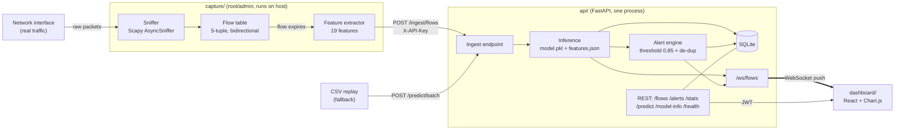

# 🛡️ NetGuard AI — Real-Time Network Attack Detection & Early Warning

> **Smart India Hackathon 2026 — Problem Statement SIH26153**
> *AI-based Network Attack Forecasting from Network Traffic Data*
> A 5th Semester VTU Mini Project

NetGuard AI is a **network sensor + machine-learning classifier + live dashboard**. A sensor
sniffs real packets off a real network interface, turns them into flow features, and a trained
model labels every flow (`Benign`, `DoS_DDoS`, `PortScan`, `BruteForce`) within seconds. Results
stream to a dashboard over WebSocket and are stored for review.

This is **not a CSV demo**. The project is validated by running real attack tools against a real
(isolated) lab network and measuring what the sensor catches. A CSV replay mode exists only as a
fallback for restricted networks and repeatable tests.

> This document supersedes the earlier README (MERN-based). Section 2 explains every decision
> that changed and why. `AGENTS.md` remains the contract for feature order, labels, and the API;
> its required amendments are listed in Section 12.

---

## Table of Contents

1. [What "real-world" means here](#1-what-real-world-means-here)
2. [Final tech stack & conflict resolutions](#2-final-tech-stack--conflict-resolutions)
3. [System architecture](#3-system-architecture)
4. [Real-world deployment: the lab network](#4-real-world-deployment-the-lab-network)
5. [Repository layout](#5-repository-layout)
6. [Machine learning](#6-machine-learning)
7. [Capture service](#7-capture-service)
8. [Backend API](#8-backend-api)
9. [Dashboard](#9-dashboard)
10. [Setup & running](#10-setup--running)
11. [Git workflow & team ownership](#11-git-workflow--team-ownership)
12. [Amendments required in AGENTS.md](#12-amendments-required-in-agentsmd)
13. [Testing & live evaluation plan](#13-testing--live-evaluation-plan)
14. [Limitations (honest version)](#14-limitations-honest-version)
15. [Roadmap](#15-roadmap)
16. [Safety, legal & ethics](#16-safety-legal--ethics)
17. [Viva FAQ](#17-viva-faq)
18. [Team & license](#18-team--license)

---

## 1. What "real-world" means here

A project is real-world when it survives contact with real traffic. NetGuard AI commits to:

| Claim | How we back it up |
|---|---|
| Uses real traffic | Scapy sniffs a live NIC; no replayed data in the main demo |
| Detects real attacks | `nmap`, `hping3`, `hydra` run manually against a lab victim; results are measured, not asserted |
| Handles the train/serve gap | Model is trained on CICIDS2017 **plus traffic we capture ourselves** with the same extractor used in production (see §6) |
| Runs as a service, not a script | API and sensor run under `systemd` (Linux) with logs, restart-on-failure, and config via `.env` |
| Is secured | JWT login for the dashboard, API key for the sensor, no open endpoints that write data |
| Is operable | Alert de-duplication, health endpoints, sensor heartbeat, stored history |
| Is honest about limits | Section 14 |

"Forecasting" in the problem statement is delivered as **early warning**: flows are classified
while the attack is in progress (seconds, not after the fact), and alerts are aggregated per
source IP so the dashboard shows an attack building up, not just isolated events.

---

## 2. Final tech stack & conflict resolutions

The old README described Node.js + Express + MongoDB + Socket.io + Docker + Kafka. `AGENTS.md`
said the opposite. The code already in the repo (`ml/train.py`, `requirements.txt`) follows
`AGENTS.md`. **We go with a Python-first stack**, for these reasons:

- The sensor and the model are Python (Scapy, scikit-learn). Adding a Node backend meant a
  second language whose only job was to forward data between two Python services.
- Every hop is a place for a real-time system to lag or break. Fewer hops = fewer failures.
- One backend language means the ML person, the capture person, and the backend person can all
  read and review each other's code.

### Decisions

| Topic | Old README | AGENTS.md | **Final decision** | Why |
|---|---|---|---|---|
| Backend | Node + Express | FastAPI | **FastAPI (Python 3.12)** | Loads the model in-process; native async and WebSocket; auto-generated `/docs` for demos |
| Real-time push | Socket.io | FastAPI WebSocket | **FastAPI WebSocket** (`/ws/flows`) | Browser-native `WebSocket`; no extra library |
| Database | MongoDB | SQLite | **SQLite (WAL mode) via SQLAlchemy 2.0** | Zero setup; flow records are tabular; SQLAlchemy lets us switch to PostgreSQL by changing one URL |
| ML serving | Separate FastAPI microservice | (implicit) | **Model loaded inside the API process** | One less network hop; `ml/` is training-only |
| Queue | Redis/Kafka (at scale) | None | **In-process `asyncio.Queue`** | Real Kafka is unjustified at lab scale; noted in roadmap only |
| Frontend | React + Recharts/Chart.js | React + Chart.js | **React + Vite + Chart.js (`react-chartjs-2`)** | See note below |
| Packet capture | Scapy/PyShark | Scapy | **Scapy** (Npcap on Windows, libpcap on Linux) | Full control of features; matches spec |
| Auth | JWT + roles | Not defined | **JWT (Admin/Viewer) for users, static API key for the sensor** | Simple, standard, testable |
| Containers | Docker Compose | "No Docker" | **Not required.** Optional `Dockerfile` for `api` + `dashboard` only | Packet capture must run on the host NIC; Docker adds friction for a student project |
| Attack classes | 6+ incl. Botnet, Web Attack | 4 | **4: Benign, DoS_DDoS, PortScan, BruteForce** | These are the ones we can reproduce live and measure |
| Python version | 3.10+ | 3.10+ (req. file says 3.12+) | **3.12 recommended, 3.10 minimum** | Pinned libs support both |

> **Note on "No Node.js":** React is compiled with Node-based tooling (Vite). So Node is
> **allowed as a frontend build tool only**. There is no Node server anywhere at runtime: in
> production, FastAPI serves the built `dashboard/dist` files, so the whole product runs on one
> port with one Python process.

### Final stack at a glance

| Layer | Technology |
|---|---|
| Sensor | Python 3.12, Scapy 2.6, custom flow table |
| ML | pandas, scikit-learn (Random Forest), joblib |
| API | FastAPI, Uvicorn, Pydantic v2, SQLAlchemy 2.0, PyJWT, bcrypt, python-multipart |
| Storage | SQLite (WAL) → PostgreSQL-ready |
| Frontend | React 18, Vite, Chart.js, native WebSocket |
| Deploy | Linux VM or Raspberry Pi, `systemd`, `.env` config |
| Tests | pytest, httpx (API), scripted live attacks (system) |

---

## 3. System architecture



**Data path (one flow, end to end):**

1. Packets arrive on the NIC; the sensor groups them into bidirectional flows keyed by
   `(src_ip, src_port, dst_ip, dst_port, protocol)`.
2. A flow **expires** on TCP FIN/RST, or after an idle timeout (default 5 s) or an active
   timeout (default 30 s). Expired flows are turned into the 19 features from `AGENTS.md`.
3. The sensor POSTs the flow (with `src_ip`, `dst_ip`, features) to `/ingest/flows`.
4. The API orders features per `features.json`, runs `predict` + `predict_proba`, and maps the
   integer class to its string label.
5. The result is stored in SQLite and pushed to every dashboard client on `/ws/flows`.
6. If `label != "Benign"` **and** `confidence > 0.85`, the alert engine raises or updates an
   alert, de-duplicated per `(src_ip, label)` within a 30 s window so a 10,000-flow scan is
   **one** alert with a counter, not 10,000 popups.

---

## 4. Real-world deployment: the lab network

Sniffing your own laptop's loopback is not a convincing demo (and on Windows, Scapy cannot see
loopback traffic by default). We use a small **isolated lab** instead:

```
                 Host-only / internal virtual network (no internet route)
   ┌──────────────┐        ┌──────────────┐        ┌──────────────────────────┐
   │ Attacker VM  │ ─────► │  Victim VM   │ ◄───── │  Sensor VM / Host        │
   │ Kali Linux   │        │ Ubuntu Server│  mirror│  capture/ + api/ +       │
   │ nmap, hping3,│        │ SSH, Apache, │  /     │  dashboard               │
   │ hydra        │        │ FTP          │ same   │  (promiscuous mode on)   │
   └──────────────┘        └──────────────┘ switch └──────────────────────────┘
```

- **Hypervisor:** VirtualBox or VMware. Put all three machines on one *Internal Network* /
  *Host-only* adapter. Set the sensor's adapter to **Promiscuous Mode: Allow All** so it sees
  traffic between the other two.
- **Benign traffic:** script `curl`/`wget` requests, SSH logins with the right password, DNS
  lookups, and file downloads from the victim, plus some normal browsing on the sensor host.
- **Attack traffic (run manually by a human, never by an agent):**
  - Port scan: `nmap -sS <victim>`
  - DoS: `hping3 -S --flood -p 80 <victim>` (lab only, rate-limit it)
  - Brute force: `hydra -l <user> -P <wordlist> ssh://<victim>`

**Alternative, no VMs — the hotspot sensor:** enable a Wi-Fi hotspot (or an Ethernet-shared
connection) on the sensor laptop and connect a test device to it. The laptop is now the gateway,
so its interface carries **all** of that device's traffic. This is a genuine multi-device
capture without needing a managed switch.

**Production equivalent:** the same sensor code, unmodified, runs on a Linux box fed by a switch
**SPAN/mirror port** or a network TAP. Only where packets come from changes.

**Running as a service (Linux):** `deploy/netguard-api.service` and
`deploy/netguard-capture.service` (systemd units, `Restart=on-failure`, environment from
`/etc/netguard/.env`). The capture unit runs as root or with `CAP_NET_RAW`; the API runs
unprivileged.

---

## 5. Repository layout

Matches the existing folders; new files are marked ✚.

```
netguard/
├── AGENTS.md                  # contract: features, labels, API (amend per §12)
├── README.md                  # ← replace with this file after team review
├── requirements.txt           # Python deps, one section per folder
├── .env.example            ✚
├── test_setup.py
│
├── ml/                        # TRAINING ONLY
│   ├── train.py
│   ├── test_model.py
│   ├── collect_local.py    ✚  # label locally captured lab traffic for training
│   └── artifacts/             # model.pkl, features.json, metrics.json (gitignored binaries)
│
├── capture/                   # SENSOR (needs root/admin)
│   ├── sniffer.py          ✚  # AsyncSniffer + BPF filter
│   ├── flow_table.py       ✚  # 5-tuple flows, timeouts
│   ├── features.py         ✚  # the 19 features, exact AGENTS.md order
│   ├── client.py           ✚  # POST to /ingest/flows with retry buffer
│   └── replay.py           ✚  # CSV/pcap replay (fallback mode)
│
├── api/                       # BACKEND (FastAPI)
│   ├── main.py             ✚  # app factory, CORS, static mount of dashboard/dist
│   ├── config.py           ✚  # settings from .env
│   ├── inference.py        ✚  # load model.pkl + features.json, predict
│   ├── db.py               ✚  # SQLAlchemy engine/session, models
│   ├── auth.py             ✚  # JWT, API key, roles
│   ├── alerts.py           ✚  # threshold + de-dup engine
│   ├── ws.py               ✚  # connection manager, broadcast
│   ├── routes/             ✚  # predict.py, ingest.py, flows.py, alerts.py, auth.py, system.py
│   └── tests/              ✚
│
├── dashboard/                 # FRONTEND (React + Vite)
│   └── src/ (pages, components, hooks/useFlowSocket.js, services/api.js)
│
├── data/                      # datasets, gitignored (CICIDS2017 CSVs, local captures)
├── deploy/                 ✚  # systemd units, nginx sample (optional)
└── docs/                      # report, diagrams, evaluation results
```

---

## 6. Machine learning

- **Model:** Random Forest, selected by `ml/train.py` from candidate variants. Tabular flow
  features are where tree ensembles are strongest, train in minutes on a CPU, and expose
  feature importances for the "why was this flagged" panel.
- **Features:** exactly the 19 in `AGENTS.md` §3, in that order. `features.json` is saved next
  to `model.pkl` and is the **only** source of feature order at inference time.
- **Labels:** CICIDS2017 labels are mapped to four classes: `Benign`, `DoS_DDoS`, `PortScan`,
  `BruteForce`. Other CICIDS classes (Botnet, Web Attack, Infiltration) are dropped in v1.

### The train/serve gap (the part most student projects skip)

CICIDS2017 was produced by *CICFlowMeter*, which has known quirks (flag counters, timeouts,
unit scaling; `AGENTS.md` flags SYN/ACK/PSH). Our sensor computes features with **different
code**, so a model trained only on CICIDS2017 can score well offline and poorly live. Our
mitigations:

1. `ml/train.py` converts CICIDS2017 units to the NetGuard spec (µs → s).
2. **We record our own labeled traffic** in the lab (§4): a known-benign session, then a known
   `nmap` scan, a known `hping3` flood, a known `hydra` run. `ml/collect_local.py` pairs each
   capture window with its label using the sensor's own feature extractor.
3. That local data is **mixed into training**, and a slice is held out purely for **live
   evaluation** (§13). Reported numbers must include the live results, not only the CICIDS2017
   test split.

### Serving

`api/inference.py` loads `model.pkl` and `features.json` once at startup, builds a DataFrame
with columns in the saved order, and returns `{label, confidence, top_features}`. Top features
are the global Random Forest importances for the model, paired with that flow's own values.
(Per-flow attribution such as SHAP is a roadmap item.)

---

## 7. Capture service

- **Sniffing:** `scapy.AsyncSniffer(iface=..., store=False, filter="ip")` with a BPF filter so
  the kernel drops irrelevant traffic before Python sees it.
- **Flow table:** dictionary keyed by a canonical 5-tuple (both directions map to one key).
  The first packet defines the *forward* direction.
- **Expiry:** TCP FIN/RST, idle timeout (5 s), active timeout (30 s). Timeouts are settings.
- **Features:** the 19 in spec order; zero-duration flows return `0.0` for rate features (no
  divide-by-zero); IAT is in seconds.
- **Resilience:** if the API is unreachable, flows go into a bounded local buffer and are
  retried; the sensor never crashes because the backend restarted.
- **Privileges:** root (Linux/macOS) or Administrator + **Npcap** (Windows).
- **Known limit:** Scapy is Python and will drop packets under very high packet rates (a
  volumetric flood at line speed). For the lab this is fine; §14 covers the production answer.

---

## 8. Backend API

Contract for feature order, labels, `/predict`, `/predict/batch`, `/health`, `/model-info`,
and `/ws/flows` is in `AGENTS.md` §4 and is unchanged. **Additions** for a real deployment:

| Method | Endpoint | Auth | Purpose |
|---|---|---|---|
| POST | `/ingest/flows` | API key | Sensor submits flows; API classifies, stores, alerts, broadcasts |
| POST | `/auth/login` | – | Returns JWT |
| GET | `/flows` | JWT | History with filters (`label`, `src_ip`, `from`, `to`) and pagination |
| GET | `/flows/{id}` | JWT | One flow with its features and top features |
| GET | `/alerts` | JWT | Aggregated alerts; `?status=open` |
| PATCH | `/alerts/{id}` | JWT (Admin) | Acknowledge / resolve |
| GET | `/stats` | JWT | Counts per label over a time window (for charts) |
| GET | `/capture/status` | JWT | Sensor online/offline from last heartbeat / last ingest time |
| POST | `/predict/batch` | JWT | CSV/replay path; same inference as ingest |
| GET | `/export/flows.csv` | JWT | Session export |

`/predict` stays a **pure, stateless** call (no DB write, no broadcast) so it is easy to test.
`/ingest/flows` is the only write path used by the sensor.

**WebSocket:** `ws://host:8000/ws/flows?token=<JWT>`. Event schema as in `AGENTS.md`, plus an
`"type"` field: `"flow"` or `"alert"`, so the dashboard can route messages.

**Tables (SQLite):** `users`, `flows` (id, ts, src_ip, dst_ip, dst_port, label, confidence,
features JSON, top_features JSON), `alerts` (id, first_seen, last_seen, src_ip, label,
max_confidence, flow_count, status).

**Config (`.env`):** `DATABASE_URL`, `MODEL_DIR`, `JWT_SECRET`, `SENSOR_API_KEY`,
`ALERT_THRESHOLD=0.85`, `ALERT_DEDUP_SECONDS=30`, `CORS_ORIGINS`.

---

## 9. Dashboard

- **Live view:** flows/sec chart, label distribution (doughnut), rolling table of latest flows,
  red banner when an alert opens; all driven by the WebSocket.
- **Alerts page:** aggregated alerts per source IP with counts and status.
- **Flow detail:** features and top contributing features for any flow.
- **History:** filter, page, export CSV.
- **System bar:** sensor online/offline, model version, current threshold.
- **Login:** Admin (acknowledge alerts, manage users) vs Viewer (read-only).
- `hooks/useFlowSocket.js` reconnects automatically with backoff; the UI shows a
  "reconnecting…" state rather than silently going stale.
- **Dev:** `npm run dev` on `:5173` proxying to `:8000`. **Prod:** `npm run build`, and FastAPI
  serves `dashboard/dist`.

---

## 10. Setup & running

### Prerequisites
Python 3.12 (3.10 minimum), Node 18+ (frontend build tooling only), Git.
Sensor host: Npcap (Windows) or libpcap (Linux). Lab: VirtualBox or VMware.

### 1. Clone and create the environment
```bash
git clone https://github.com/<org>/netguard.git
cd netguard
python -m venv venv
# Linux/macOS: source venv/bin/activate   |   Windows: venv\Scripts\activate
pip install -r requirements.txt
cp .env.example .env        # set JWT_SECRET and SENSOR_API_KEY
python test_setup.py
```

### 2. Get the model
```bash
# needs CICIDS2017 CSVs in data/ (gitignored)
python ml/train.py
python ml/test_model.py
```
Or copy `ml/artifacts/` from the ML teammate. Binaries are gitignored, so they do not arrive
with `git pull`.

### 3. Start the backend
```bash
uvicorn api.main:app --reload --port 8000     # docs at http://localhost:8000/docs
```

### 4. Start the dashboard
```bash
cd dashboard && npm install && npm run dev    # http://localhost:5173
```

### 5. Start the sensor (only on a network you own)
```bash
pip install scapy==2.6.1                      # not in requirements.txt by design
# Linux:   sudo venv/bin/python -m capture.sniffer --iface eth0
# Windows: (Administrator terminal)  python -m capture.sniffer --iface "Wi-Fi"
```

### 6. Fallback: replay without live sniffing
```bash
python -m capture.replay --csv ml/artifacts/held_out_sample.csv
```

---

## 11. Git workflow & team ownership

`main` is always runnable and protected (pull request + 1 approval). Work happens on short-lived
branches named `<area>/<task>`, merged within a few days.

| Teammate | Owns | Branch prefix |
|---|---|---|
| ML lead | `ml/`, `data/` | `ml/` |
| Backend | `api/`, `deploy/` | `api/` |
| Frontend | `dashboard/` | `dashboard/` |
| Capture owner (**assign one**) | `capture/` | `capture/` |
| Docs/Testing | `docs/`, README, `api/tests` review, live evaluation | `docs/`, `test/` |

```bash
git switch main && git pull
git switch -c api/skeleton
git add api/ && git commit -m "api: FastAPI skeleton with /health"
git push -u origin api/skeleton          # open PR
git fetch origin && git rebase origin/main   # if main moved
```

Rules: touch only your own folder; changes to `AGENTS.md` need approval from everyone; edit only
your own section of `requirements.txt`; commit messages start with the area (`api:`, `ml:`…).

**Suggested backend branch order:** `api/skeleton` → `api/inference` → `api/ingest` →
`api/websocket` → `api/db-history` → `api/alerts` → `api/auth` → `api/tests`.

---

## 12. Amendments required in AGENTS.md

Small, deliberate edits so the contract matches this README (open one PR, all four approve):

1. §1 **Strict Constraints:** replace with *"No Node.js server, No MongoDB, No Kafka. Node is
   permitted only as a frontend build tool. Docker is optional and never required."*
2. §4 **REST:** add `/ingest/flows`, `/auth/login`, `/flows`, `/alerts`, `/stats`,
   `/capture/status` (Section 8 above).
3. §4 **WebSocket:** add the `token` query parameter and the `"type"` field.
4. §5 **Alerting:** add *"alerts are de-duplicated per `(src_ip, label)` within
   `ALERT_DEDUP_SECONDS`"*.
5. §1 **Model:** note that training data = CICIDS2017 subset **+ locally captured lab traffic**
   (already stated) and that live evaluation results are reported alongside offline metrics.

---

## 13. Testing & live evaluation plan

**Automated**
- `test_setup.py`, `ml/test_model.py`: environment and model artifact checks.
- `api/tests/`: pytest + httpx for `/predict`, `/ingest/flows`, threshold logic, de-dup,
  auth failures, and WebSocket broadcast.
- `capture/` unit tests: feature extractor against hand-built packet lists with known answers
  (e.g., 3 packets → known counts, duration, IAT).

**Live lab evaluation (goes into the final report)**

| Scenario | Tool (run manually) | Duration | Record |
|---|---|---|---|
| Benign baseline | browsing, `curl`, valid SSH | 10 min | false-positive rate |
| Port scan | `nmap -sS`, `nmap -sT` | 3 runs | detection rate, time to first alert |
| DoS/SYN flood | `hping3 -S --flood` (limited) | 3 runs | detection rate, dropped packets |
| Brute force | `hydra` on SSH/FTP | 3 runs | detection rate, time to first alert |

Report a per-class confusion matrix and precision/recall from **live** runs next to the offline
CICIDS2017 numbers. If live results are worse (they often are), say so and show the fix
(more local training data); this is a stronger result than a single 99% accuracy figure.

---

## 14. Limitations (honest version)

- **Domain shift:** a model trained on 2017 lab data may not generalise to your network;
  mitigated, not eliminated, by local training data.
- **Supervised only:** novel attacks outside the four classes may be labelled `Benign` or
  misclassified. Anomaly detection is a roadmap item.
- **Scapy throughput:** fine for the lab; it will drop packets under very high packet rates.
  A production sensor would use a compiled capture path (AF_PACKET/libpcap-based or an existing
  engine such as Zeek or Suricata feeding the same feature schema).
- **Flow-level, not payload-level:** it works on encrypted traffic (we never read payloads), but
  it cannot see application-layer attacks such as SQL injection.
- **Visibility:** the sensor sees only the traffic that reaches its interface; a whole-network
  view needs a mirror port, TAP, or gateway placement (§4).
- **SQLite:** single-writer; adequate for one sensor, replace with PostgreSQL for many.
- **Detection is per-flow.** A port scan generates many tiny flows; the alert engine's per-source
  aggregation is what turns them into one meaningful alert.

---

## 15. Roadmap

| Phase | Scope |
|---|---|
| **1 (MVP)** | Sensor → `/ingest/flows` → inference → SQLite → WebSocket → live dashboard; lab evaluation |
| **2** | Auth/roles, alert aggregation & acknowledgement, CSV export, `systemd` units |
| **3** | **Active response:** Admin-approved "Block IP" button that adds an `nftables`/`iptables` rule (dry-run by default, always logged, auto-expiring) |
| **4** | Isolation Forest anomaly score for unknown attacks; SHAP explanations; PostgreSQL; multiple sensors with a sensor ID; optional Dockerfiles for API + dashboard |

Kafka/Redis, Kubernetes and a SIEM webhook are out of scope for the semester and appear only as
"how it would scale" answers.

---

## 16. Safety, legal & ethics

- Capture and attack **only** on networks and devices you own or have written permission to
  test. The lab in §4 is isolated for exactly this reason.
- Attack tools (`nmap`, `hping3`, `hydra`) are run **manually by a person**, never by scripts in
  the repo or by an automated agent.
- Packet payloads are never stored; only the 19 flow statistics and IP/port metadata.
- Active blocking (Phase 3) is off by default and requires explicit Admin confirmation.

---

## 17. Viva FAQ

**Why Python for everything?** The sensor and model are Python; a Node layer only relayed data
between them. Fewer hops means lower latency and fewer failure points.

**Why SQLite, not MongoDB?** Flow records are fixed-schema and tabular; SQLite needs no server.
SQLAlchemy makes moving to PostgreSQL a config change.

**Is it really real-time?** Yes: real packets, a sliding flow table, and WebSocket push. Latency
is bounded by flow timeouts (seconds), and we measure time-to-first-alert in the live evaluation.

**Isn't a model trained on CICIDS2017 useless on real traffic?** Often it degrades, which is why
we add locally captured, labelled traffic and report live results separately.

**How does it scale?** Add sensors (each with an ID), replace the in-process queue with
Redis/Kafka, move to PostgreSQL, and run several API workers. The feature schema and model
contract do not change.

**Why not deep learning?** Tabular flow features favour tree ensembles; they train fast on a
CPU and are explainable.

**What if the API is down?** The sensor buffers flows locally and retries.

**Why is `/predict` separate from `/ingest/flows`?** `/predict` is a pure function for testing
and replay; `/ingest/flows` has side effects (store, alert, broadcast) and needs the sensor key.

---

## 18. Team & license

| Name | Role | Owns |
|---|---|---|
| _Name_ | ML lead | `ml/`, `data/` |
| _Name_ | Backend | `api/`, `deploy/` |
| _Name_ | Frontend | `dashboard/` |
| _Name_ | Capture | `capture/` |
| _Name_ | Docs/Testing | `docs/`, live evaluation |

Developed for academic purposes as a VTU 5th Semester Mini Project (SIH 2026, SIH26153).
